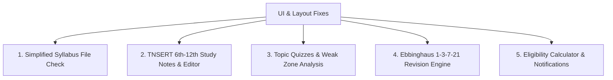

# DayZero: Strategy, Revision, and Layout Architecture Plan

This implementation plan details the immediate UI layout fixes and lays out the functional architecture for the 5 major long-term features of the **DayZero** TNPSC study companion.

---

## User Review Required

Please review the proposed design choices for the Android layout fix and the feature specifications before we begin execution:

> [!IMPORTANT]
> **Android Layout Resolution (Translucent vs. Solid Boundary):**
> We have two ways to resolve the top (status bar) and bottom (navigation buttons) overlap:
> 1. **Solid boundaries (Recommended):** Change `"edgeToEdgeEnabled": false` in `app.json`. This completely disables the app rendering behind the status and navigation bars on Android. The OS handles bounds perfectly, preventing any overlaps or tap interference across all Android versions/devices without requiring extra package installations.
> 2. **Adjusted translucent padding:** Keep `"edgeToEdgeEnabled": true` and apply custom top padding `RNStatusBar.currentHeight` to the `safeArea` and bottom padding to the navigation bar. 
> *Our recommendation is Option 1 (changing `edgeToEdgeEnabled` to `false`) for guaranteed, native, and bulletproof safety. Please confirm if this is acceptable.*

---

## Proposed Changes & Feature Architecture

We will implement the initial changes in a structured phase: **Phase 1A: UI Correction & Decluttering**, followed by incremental feature branches for the remaining items.

### 1. UI & Layout Corrections [IMMEDIATE]

#### [MODIFY] [app.json](file:///c:/Users/DELL/Downloads/DayZero/app.json)
* Disable `edgeToEdgeEnabled` or adjust configuration for safe-area compliance.
* Ensure consistent status bar styling.

#### [MODIFY] [App.js](file:///c:/Users/DELL/Downloads/DayZero/App.js)
* **Status Bar & Navigation:** Import `Platform` and `StatusBar` from `'react-native'`. Apply safe top paddings `paddingTop: Platform.OS === 'android' ? StatusBar.currentHeight : 0` to `safeArea` style if needed.
* **Home Page Decluttering:** 
  * Remove `progressHint` text (`"Next up: ..."`) from the progress container.
  * Completely remove `strategyHighlightBox` ("Today's Focus: Top 3 Units").
  * Ensure the home dashboard looks premium, minimal, and showcases only the progress bars, countdown timer numbers, and a single main action button to enter the hubs.

---

### 2. Major Action Items Architecture [LONG-TERM]

#### Feature 1: Simple Syllabus Check
* **Goal:** Keep the official interactive syllabus tracker clean, lightweight, and offline-based. No over-engineered database syncs. 
* **Design:** Users can view the structural lists and toggle completion checkboxes, reading data directly from `syllabus.js`.

#### Feature 2: TNSERT (Tamil Nadu State Board 6th-12th) Notes Integration
* **Goal:** Study strictly what is needed using official school book lines, derivations, and relevant current affairs without bloated academy notes.
* **Design:**
  * In the Interactive Syllabus page, tapping a topic will open a **"Topic Details & TNSERT Notes"** modal.
  * We will pre-populate high-yield summaries, key equations, and quotes from TN State Board (Samacheer Kalvi) 6th-12th textbooks for important exam topics (e.g. Thirukkural, Indian Polity highlights, Aptitude formulas).
  * We will provide an **Interactive Notes Editor** under each topic. The user can type their own textbook derivations, notes, and local current affairs.
  * Data is saved persistently inside `AsyncStorage` under a `user_topic_notes` key.

#### Feature 3: Test Series & Weakness Analysis
* **Goal:** Practice topic-wise and full-length tests, identifying where the user is dropping marks.
* **Design:**
  * Add a **"Topic Practice Quiz"** (5-10 multiple choice questions) under each topic modal, and a **"Mock Test Series"** (full-length/unit-wise tests) under the Tests tab.
  * Create a **Results Analysis Dashboard**:
    * Display raw score, accuracy, and time taken.
    * Break down questions by syllabus sub-topic.
    * Identify **"Weak Zones"** (topics with low accuracy) and present direct **"Active Recall"** button links that open the study notes modal for those specific weak areas.

#### Feature 4: Ebbinghaus 1-3-7-21 Revision Tracker
* **Goal:** Review topics at intervals of 1, 3, 7, and 21 days to prevent memory decay.
* **Design:**
  * When a topic is checked as completed, we record a `completedAt` timestamp and queue it in the Ebbinghaus scheduler.
  * Calculate target revision times:
    * **Review 1:** +1 day (24 hours)
    * **Review 2:** +3 days
    * **Review 3:** +7 days
    * **Review 4:** +21 days
  * Build a **"Due Today" Revision Queue** widget/dashboard view that shows exactly what needs a review session today.
  * Allow marked-off revisions to advance to the next Ebbinghaus milestone. Include automatic, anxiety-free rescheduling if a revision date is missed.

#### Feature 5: Eligibility Calculator & Exam Notification Panel
* **Goal:** Check age limits and degree compatibilities, and show upcoming notification dates.
* **Design:**
  * Add an **"Eligibility Calculator"** tab in the Resources panel:
    * Let the user input their Date of Birth, Education Level (SSLC, HSC, Diploma, Degree), and Community Category (GT, BC, MBC, SC, ST).
    * Calculate and display eligibility for Group 1, Group 2, and Group 4 (e.g., checking age restrictions: Group 1 Max Age 34, Group 4 SSLC minimums).
  * Build an **"Important Dates Timeline"** showing upcoming official announcement and application deadlines with color-coded alerts (Active, Upcoming, Closed).

---

## Verification Plan

### Automated & Manual Verification
1. **Layout Integrity:** Verify on Android devices that the top-bar header is pushed safely below the camera cutout/status bar, and the bottom absolute-positioned tab bar sits comfortably above the system navigation line.
2. **Dashboard Cleanliness:** Ensure the main Home page contains no unit listings or text hints, and renders a premium minimalist dashboard.
3. **Persisted Notes & Quizzes:** Take sample quizzes, write custom notes, and verify that progress, notes, and results persist successfully through app reboots.
